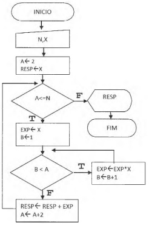

# Pensamento Computacional (COM100)

## Objetivo

Pensar e resolver problemas utilizando as seguintes técnicas principais:
- Decomposição: dividir a questão em problemas menores;
- Padrões: identificar o padrão que gera o problema;
- Abstração: entender como as soluções podem ser reutilizadas em múltiplos cenários;
- Algoritmo: definir ordem ou sequência de passos para a solução de problemas.

## Conteúdo

### Portugol Studio

O [Portugol Studio](http://lite.acad.univali.br/portugol/) é uma ferramenta para iniciantes no aprendizado de lógica programação totalmente em linguagem estruturada (em português). Os seguintes exercícios foram desenvolvidos durante o 1º bimestro do curso de Bacharel em Ciência de Dados:

1. Cálculo de Imposto de Renda:  o cálculo da alíquota do INSS poderá ser realizado direto de acordo a faixa salarial (cálculo antigo), ou considerando as novas alíquotas progressivas previstas na Reforma da Previdência, ou seja, significa que as taxas serão cobradas apenas sobre a parcela do salário que se enquadrar em cada faixa, fazendo com que o percentual descontado do total dos ganhos seja diferente.
Exemplo do cálculo para alíquota progressiva: um trabalhador que ganha R$ 5.445,00 pagará 7,5% sobre R$ 1.045,00 (R$ 78,38), acrescido de 9% sobre diferença da faixa de 1.045,01 até 2.089,60 (R$ 1.044,59), sendo R$ 94,01, mais 12% sobre diferença da faixa de 2.089,61 até 3.134,40 (R$ 1.044,79), sendo R$ 125,37, e mais 14% sobre diferença da faixa de 3.134,41 até o valor total do salário de R$ 5.445,00 (R$ 2.310,59), sendo R$ 323,48, totalizando o valor da alíquota do INSS em R$ 621,25;
2. Média de um valor: 
3. Conversor de temperatuda ºC para F: Converte uma temperatura de Celsius para Fahrenheit;
4. Atividade avaliativa da Semana 3: implementar o código para o fluxograma abaixo:

